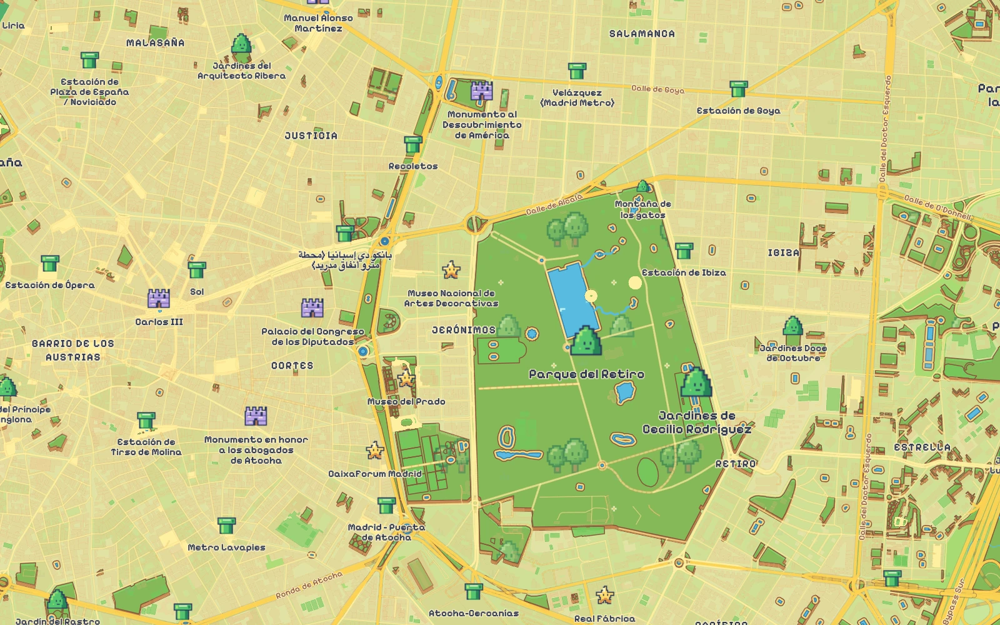

# Tileflow Community Maps

Maps made with Tileflow. Explore, remix, and contribute.

An open collection of map designs, started by Tileflow. Each map includes editable TypeScript,
icons, patterns, fonts, and a ready-to-preview configuration.

| Cyberpunk                                                                                                      | Terminal                                                                                 | Super Tile World                                                                                                  |
| -------------------------------------------------------------------------------------------------------------- | ---------------------------------------------------------------------------------------- | ----------------------------------------------------------------------------------------------------------------- |
| [](maps/cyberpunk) | [](maps/terminal) | [](maps/super-tile-world) |
| A city of electric outlines, glowing routes, and destination beacons.                                          | Monochrome green cartography with scanlines and crisp uppercase labels.                  | A cartridge world of golden routes, pixel sprites, and layered shores.                                            |

Previews show Madrid. Map data © [OpenStreetMap contributors](https://www.openstreetmap.org/copyright).
See [preview and asset attribution](THIRD_PARTY_NOTICES.md).

## Try a map

Use Node.js 22 or newer and npm. From a terminal:

```sh
git clone https://github.com/tileflow/community-maps.git
cd community-maps
npm ci
npm run preview:cyberpunk
```

Open the local address printed by the CLI. To try Terminal, stop the preview and run:

```sh
npm run preview:terminal
# Or explore the pixel-art world:
npm run preview:super-tile-world
```

Preview uses Tileflow World over the network. Local authoring does not require a Tileflow account
or API key. Fonts, icons, and patterns are included; geographic tiles are not stored in this repository.

## Make it yours

Edit `maps/cyberpunk/tileflow.config.ts`, `maps/terminal/tileflow.config.ts`, or
`maps/super-tile-world/tileflow.config.ts` to change the camera,
add layers, or extend the design. Coordinates use `[longitude, latitude]`. Edit the neighboring
`index.ts` for the complete map design and `assets/` for its artwork and fonts.

Validate or build the selected map:

```sh
npm run validate:maps
npm run build:cyberpunk
npm run build:terminal
npm run build:super-tile-world
```

The build commands write each map to `.tileflow/build/<map-id>/`, with styles and resources for
local or self-hosted delivery.
Keep each generated manifest and its asset files together. These maps use packaged fonts; check
the CLI's hosted-target validation before choosing managed deployment.

## Use in another project

This repository builds the `@tileflow/community-maps` package. It is available from GitHub and is
not published to the npm registry. Choose a full commit SHA from this repository's history, replace
`COMMIT_SHA` below, and install it with the compatible Core version:

```sh
npm install github:tileflow/community-maps#COMMIT_SHA @tileflow/core@0.1.0-alpha.30
```

The Git installation builds the package. Use a Node.js environment with install scripts enabled.
Then create your project's `tileflow.config.ts`:

```ts
import { defineMap } from "@tileflow/core";
import { cyberpunk } from "@tileflow/community-maps";

export default defineMap({
  id: "my-city",
  name: "My city",
  version: 1,
  extends: cyberpunk,
  view: { center: [-3.7038, 40.4168], zoom: 14 },
});
```

Use `terminal` for the green-screen map or `superTileWorld` for the pixel-art overworld. All maps are immutable shared definitions; extend them
with `defineMap` instead of mutating them. The package also exports `cyberpunkFonts`, `cyberpunkIcons`,
`terminalFonts`, `terminalIcons`, `superTileWorldFonts`, and `superTileWorldIcons` for explicit asset composition.

The [Tileflow SDK documentation](https://github.com/tileflow/tileflow-sdk#readme) covers CLI and
framework integration. Use the same Core version in the map package and its consumer.

## Map names

| Map              | Export           | Map ID             |
| ---------------- | ---------------- | ------------------ |
| Cyberpunk        | `cyberpunk`      | `cyberpunk`        |
| Terminal         | `terminal`       | `terminal`         |
| Super Tile World | `superTileWorld` | `super-tile-world` |

These maps and their assets are maintained here, independently of the official `@tileflow/maps`
catalog. Import them from `@tileflow/community-maps`. When migrating from older SDK versions,
replace `matrix` with `terminal`; `cyberpunk` and `superTileWorld` keep their export names but
change packages. The earlier community `neonGrid` export and `neon-grid` IDs are now
`cyberpunk`. Update explicit map, theme, and icon references accordingly; no legacy aliases ship.

## Contribute

Add a new map or improve an existing one through a pull request. Start with
[CONTRIBUTING.md](CONTRIBUTING.md) for the folder structure, attribution, and checks.

## License

The extracted Tileflow code and original artwork retain the [Apache-2.0 license](LICENSE).
Oxanium, Pixelify Sans, Tile World Arcade, and Noto Sans retain the font licenses shipped beside them. Map data has its own
attribution and usage terms. See [NOTICE](NOTICE) and [THIRD_PARTY_NOTICES.md](THIRD_PARTY_NOTICES.md).
