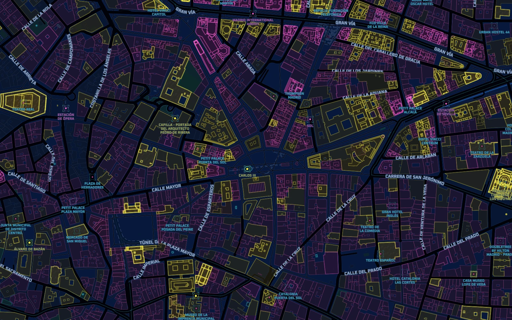

# Cyberpunk

A dark city map with electric blue, magenta, and yellow accents, layered road glows, geometric
building signals, and destination beacons. Designed by Tileflow.

Map data © [OpenStreetMap contributors](https://www.openstreetmap.org/copyright).
This is an existing capture of the original design; see [preview provenance](../../THIRD_PARTY_NOTICES.md).

From the repository root, run `npm ci`, then `npm run preview:cyberpunk`.
Edit `tileflow.config.ts` for the camera and overrides or `index.ts` for the map design.
The map uses Tileflow World data and a single `dark` theme. Fonts, icons, and patterns are packaged
under `assets/`; font origins and licenses are recorded in `assets/fonts/README.md`.

Exports: `cyberpunk`, `cyberpunkFonts`, `cyberpunkIcons`. Map ID: `cyberpunk`.
The three icon/pattern IDs are `cyberpunk-circuit`, `cyberpunk-data-grid`, and
`cyberpunk-target-brackets`.

See [design notes](design.md) for the map’s visual structure.
