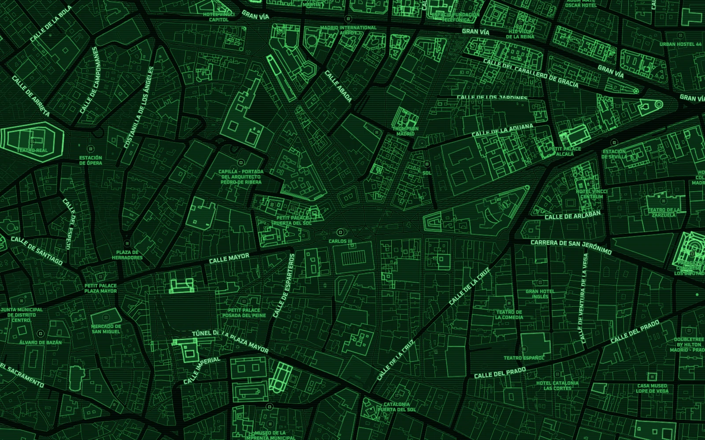

# Terminal

A monochrome phosphor-green map with scanline and dot textures, restrained road glows, compact
destination nodes, and crisp uppercase labels. Designed by Tileflow; originally distributed as Matrix.

Map data © [OpenStreetMap contributors](https://www.openstreetmap.org/copyright).
This is an existing capture of the original design; see [preview provenance](../../THIRD_PARTY_NOTICES.md).

From the repository root, run `npm ci`, then `npm run preview:terminal`.
Edit `tileflow.config.ts` for the camera and overrides or `index.ts` for the map design.
The map uses Tileflow World data and a single `dark` theme. Fonts, icons, and patterns are packaged
under `assets/`; font origins and licenses are recorded in `assets/fonts/README.md`.

Exports: `terminal`, `terminalFonts`, `terminalIcons`. Map ID: `terminal`.
The three icon/pattern IDs are `terminal-crt-scanlines`, `terminal-data-grid`, and
`terminal-poi-node`.

See [design notes](design.md) for the map’s visual structure.
